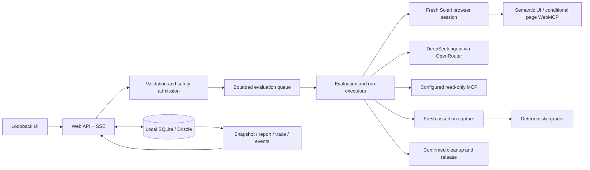

# TraceGate

TraceGate measures whether an agent can complete a bounded task on a public website reliably. You describe the task and browser-observable success criteria; TraceGate repeats it in fresh browser sessions, captures assertion evidence independently of the model, and reports deterministic PASS, FAIL, INCONCLUSIVE, or CANCELLED outcomes.

A PASS means the declared browser assertions passed from accepted fresh evidence after an explicitly completed run. It does not prove arbitrary backend business truth.

## Product boundary

TraceGate is a local functional proof of concept for anonymous, read-only public-site tasks. It rejects obvious requests involving authentication, credentials, payments, purchasing, messaging/publication, destructive actions, file transfer, permissions, sensitive data, or irreversible submission.

Supported and observed:

- semantic/accessibility browser interaction;
- independent fresh assertion capture and deterministic grading;
- repeated independent runs, live progress, reports, traces, cancellation, reload recovery, and cleanup;
- the single configured DeepSeek model through OpenRouter;
- fresh Solari browser sessions with confirmed release;
- narrow unauthenticated configured MCP with explicit endpoint/tool selection and read-only admission.

Capability qualifications:

- configured MCP passed a bounded manual gate using a real loopback Streamable HTTP fixture plus deterministic public-DNS/transport stubs; external public, authenticated, and enterprise MCP remain unverified;
- page WebMCP is implemented, but its live invocation remains externally unverified because the managed Solari browser did not expose `document.modelContext`; semantic fallback and fresh-evidence grading authority were observed;
- `llms.txt` and JSON-LD are reporting-only signals and are not agent tools;
- visual fallback, replay, and optional models are not supported product claims.

## Architecture



Assertions stay outside the agent prompt, tools, model history, and target traffic. Page content and MCP descriptors/results are untrusted; they may help navigation but never grade a run or authorize unsafe effects. Demo Store is a fixture and is not part of production evaluation or grading.

The detailed contracts and dependency direction are in the [functional plan](docs/plans/tracegate-poc-build-2026-09-01.md#5-architecture). The concise capability boundary is in the [product compass](docs/product/tracegate-product.md).

## Local setup

Requirements:

- Node `26.1.0`
- pnpm `12.0.0`
- OpenRouter API key
- Solari API key
- local SQLite storage through the bundled Drizzle migration

```bash
cd examples/tracegate
cp .env.example .env
# Set OPENROUTER_API_KEY and SOLARI_API_KEY in .env.

pnpm install --frozen-lockfile
pnpm env:check
pnpm build
pnpm db:migrate
pnpm start
```

The default UI is `http://127.0.0.1:3000`. Configuration is bounded in the product form: public HTTPS target, exact allowed origins, task, assertions, run count/concurrency, interface strategy, and optional narrow configured-MCP endpoints.

Use a fresh temporary database for disposable inspection:

```bash
DB_DIR="$(mktemp -d)"
DATABASE_URL="file:$DB_DIR/tracegate.db" pnpm db:migrate
DATABASE_URL="file:$DB_DIR/tracegate.db" pnpm start
```

Do not commit `.env` or provider credentials.

## Honest limitations

TraceGate provides practical defense in depth, not provider-grade whole-browser network confinement. It does not guarantee perfect DNS-rebinding/SSRF prevention, a forced outbound proxy, inspection of every browser-process request, harmlessness of every nominal GET, provider inventory recovery after an unidentified ambiguous create, or backend truth beyond captured browser-observable state.

Repeated cancellation requests may return HTTP 409 once the evaluation has durably left `running`. Stronger egress/DNS enforcement, authenticated MCP, page-WebMCP availability in the managed browser, visual fallback, replay, optional models, distributed queues, hosted accounts, and broader recovery are external, unsupported, or deferred work.

## Verified functional milestones

- F3: bounded provider/API/DB run plus separate live-UI observation.
- F4: one three-run concurrent evaluation passed `3/3` with run-scoped evidence/grades and confirmed releases.
- F5: queue rejection, running reload/SSE recovery, redaction, durable cancellation, truthful queued-run cancellation, terminal projection reconciliation, and zero leaks/nonterminal rows.

See the [authoritative plan](docs/plans/tracegate-poc-build-2026-09-01.md) and bounded records under [`docs/evidence`](docs/evidence/). These observations validate the scoped POC, not general reliability across arbitrary sites or tasks.
